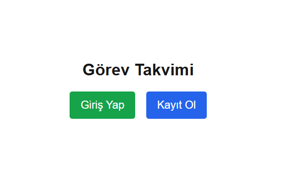
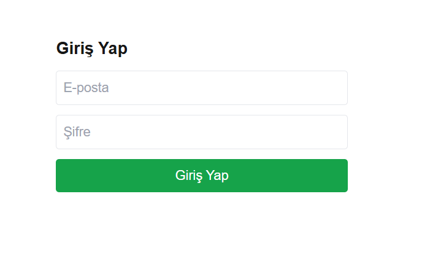
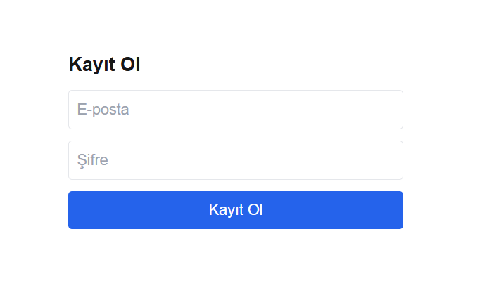
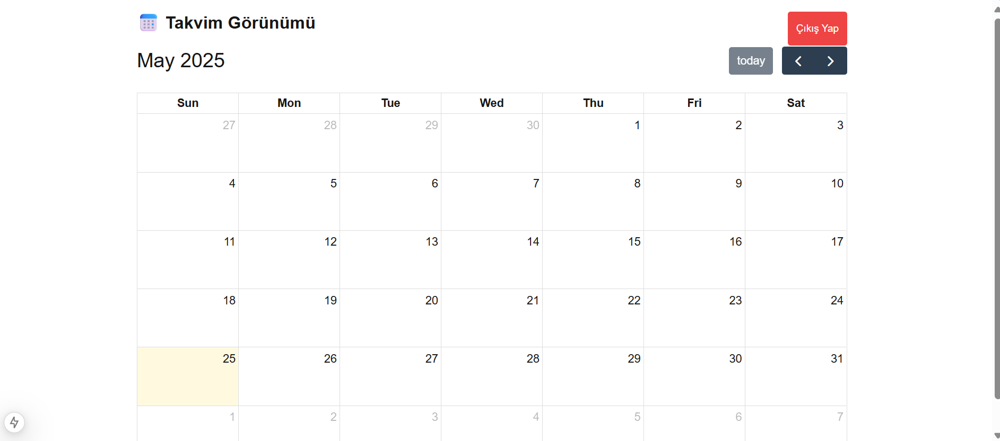
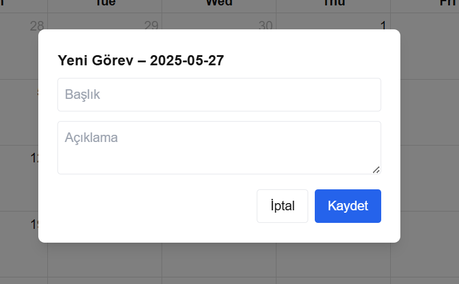
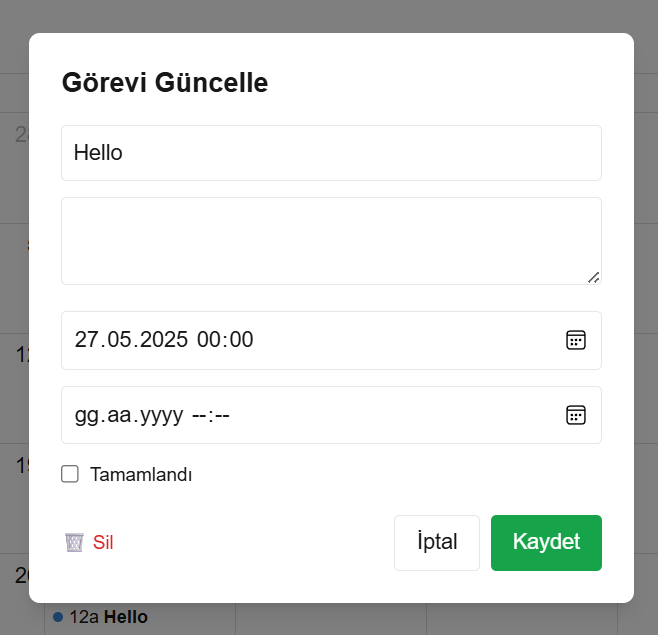

# 📅 Calendar Task App

A personal task scheduling app built with **FastAPI** (backend) and **Next.js** (frontend).  
Users can register, log in via JWT, and manage tasks directly on a calendar view.

---

## ⚙️ Technologies

- **Backend:** FastAPI, SQLAlchemy, SQLite, JWT (jose)
- **Frontend:** Next.js (App Router), Tailwind CSS, FullCalendar
- **Auth:** OAuth2 + JWT Token
- **Database:** SQLite

---

## 🚀 Features

- 🔐 JWT-based user authentication
- 📅 Task creation, update, delete, and completion status
- 👤 Private calendar per authenticated user
- 🧭 Calendar-based UI via FullCalendar
- 🔓 Logout and auth guard
- 🌍 CORS-ready backend for frontend integration

---

## 🧪 Run the App (Single Terminal)

```bash
# 1. Clone or navigate to the root of the project
cd calenderapp

# 2. Create and activate virtual environment
python -m venv venv
venv\Scripts\activate   # (Windows)

# 3. Install backend dependencies
pip install fastapi uvicorn sqlalchemy python-multipart python-jose

# 4. Run the FastAPI backend
cd backend
uvicorn main:app --reload

# 5. Move to the frontend folder
cd calenderapp/frontend

# 6. Install frontend dependencies
npm install

# 7. Start the development server
npm run dev
````

## 🔗 API Overview

| Method | Endpoint      | Description                      |
| ------ | ------------- | -------------------------------- |
| POST   | `/register`   | Register a new user              |
| POST   | `/login`      | Login and receive JWT token      |
| GET    | `/tasks/`     | Get tasks for the logged-in user |
| POST   | `/tasks/`     | Create a new task                |
| PUT    | `/tasks/{id}` | Update a task                    |
| DELETE | `/tasks/{id}` | Delete a task                    |

##📁  Authentication Flow
1.Register → /register → returns access_token

2.Login → /login → returns access_token

3.Token is saved in localStorage

4.Every request uses Authorization: Bearer <token>

5.Logout removes token from localStorage

## App ScreenShots

### Main Page



## Login Screen



## Register Screen



## Calendar Screen



## Add Task



## Task Detail




